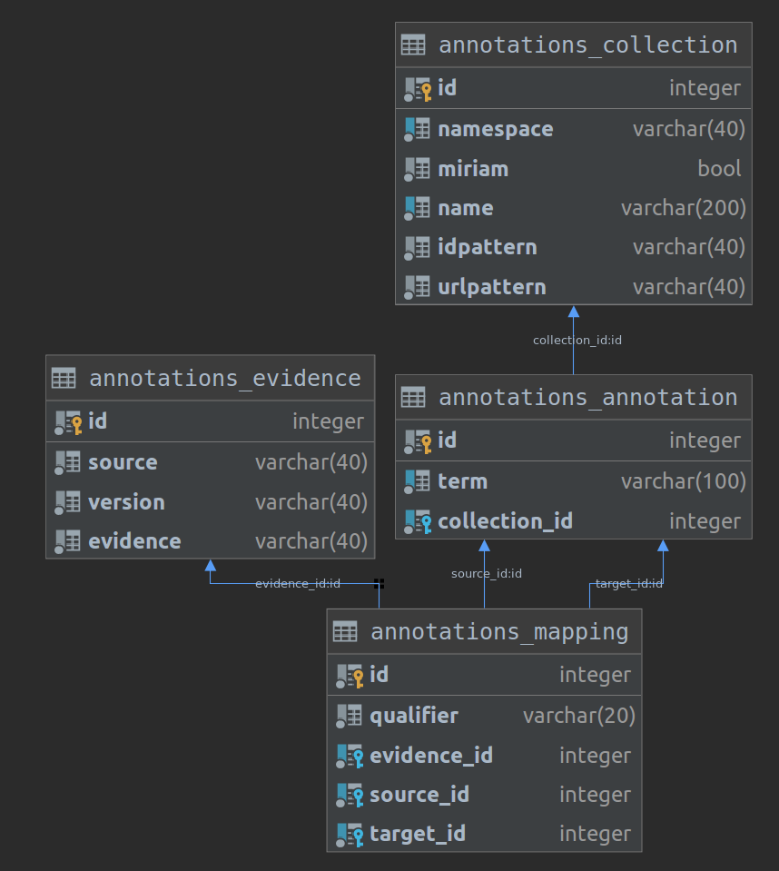

[](https://zenodo.org/badge/latestdoi/191741174)
[](http://opensource.org/licenses/LGPL-3.0)
[](https://badge.fury.io/gh/matthiaskoenig%2Fannotatedb)

<b><a href="https://orcid.org/0000-0003-1725-179X" title="https://orcid.org/0000-0003-1725-179X"></a> Matthias König</b>
and
<b><a href="https://orcid.org/0000-0002-4588-4925" title="0000-0002-4588-4925"></a> Jan Grzegorzewski</b>

<h1> AnnotateDB</h1>

`AnnotateDB` (pronounced `annotated bee`) is a database for mapping of annotations found in computational models in biology.
**Our mission** is to provide mapped annotation resources which simplify annotation of computational models and mapping of entities in such models.
**Our vision** is to provide a single integrated knowledge resource which simplifies mapping between commonly occurring 
annotations in biological models and data.


The database contains the following main tables:
- `collection`: A data source or miriam collection for annotation or xref information
- `annotation`: The combination of a term from a collection and the given collection
- `mapping`: Mapping between annotations, from source annotation to target annotation. The kind of mapping is defined by the qualifier. E.g. the qualifier `BQM_IS` encodes that the source annotation `is` the target annotation.
- `evidence`: Evidence for the given mapping between annotations.



AnnotateDB provides a high quality mapping of annotations on each other based on existing resources. 
Key features are
- annotation mappings from multiple sources
- support for custom annotation mappings
- support for `qualifiers`, i.e., more detailed relationships between annotations
- support for evidence of annotations, i.e., provenance about the source and method with which the
mapping was inferred
- `REST` based web interface
- `docker` and `docker-compose` scripts for easy local setup and deployment 

Some of these features are still in development, but will be available soon.
Please see the [issue tracker](https://github.com/matthiaskoenig/annotatedb) for more information.

### License
* Source Code: [LGPLv3](http://opensource.org/licenses/LGPL-3.0)
* Documentation: [CC BY-SA 4.0](http://creativecommons.org/licenses/by-sa/4.0/)

## Data sources

### BiGG
A major source of annotation mappings is the [BiGG Database](http://bigg.ucsd.edu/)
with information used from the latest database release available from
https://github.com/SBRG/bigg_models_data/releases 

`AnnotateDB` currently includes `BiGG-v1.5`.


### Miriam collections
Information on database collections is based on [identifiers.org](http://identifiers.org/collection) with 
an overview of the collections available at https://www.ebi.ac.uk/miriam/main/collections.
Collections were parsed with [`sbmlutils`](https://github.com/matthiaskoenig/sbmlutils).

## Installation
### Setup the development server
AnnotateDB is distributed as `docker` containers and `docker-compose` files. 

To setup the development server for local development (backend & frontend):
```bash
# clone or pull the latest source code
git clone https://github.com/matthiaskoenig/annotatedb.git
cd annotatedb

# set environment variables
set -a && source .env.local
 
# create/rebuild all docker containers
./docker-purge.sh
```
The django development server is accessible via
```
http://localhost:9000/
```

### Setup the database
Information to come. Soon we will provide the docker scripts to work with the database locally.


## Release notes
### 0.0.1
* django development server
* first database schema
* docker-compose files for backend, database and elasticsearch


---
&copy; Matthias König and Jan Grzegorzewski