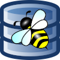
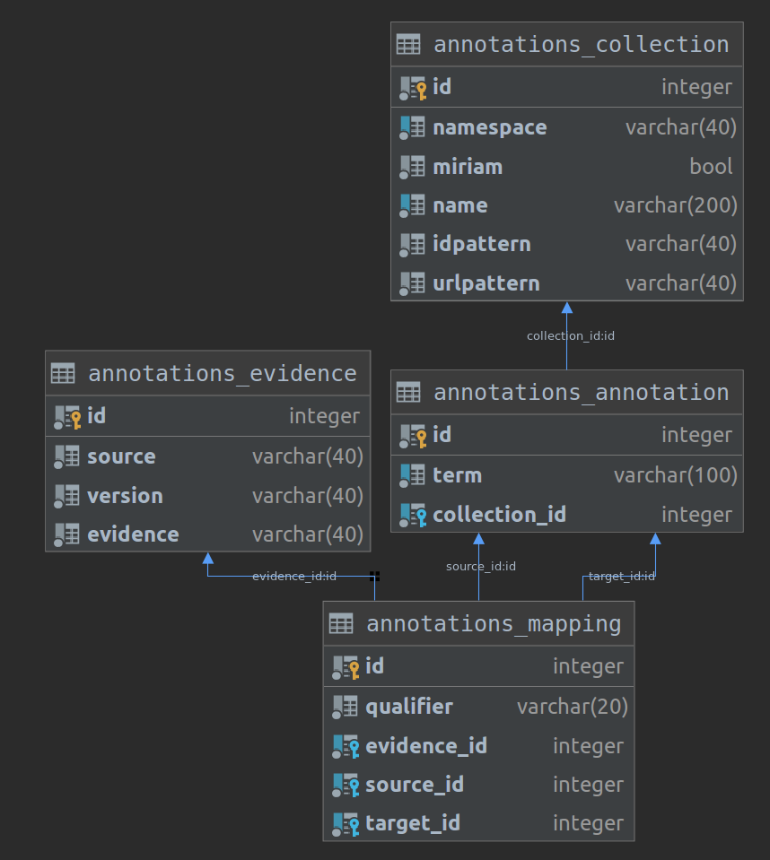

<h1> AnnotateDB</h1>


`AnnotateDB` (pronounced `annotated bee`) is a database for mapping of annotations found in computational models in biology.
It's mission is to provide mapped annotation resources which simplify annotation of computational models and mapping of entities in such models.

A major source of information is the [http://bigg.ucsd.edu/](BiGG Database).

The database consists of the following main tables:
- `collection`: A data source or miriam collection for annotation or xref information
- `annotation`: The combination of a term from a collection and the given collection
- `mapping`: Mapping between annotations, from source annotation to target annotation. The kind of mapping is defined by the qualifier. E.g. the qualifier `BQM_IS` encodes that the source annotation `is` the target annotation.
- `evidence`: Evidence for the given mapping between annotations.




## Setup
AnnotateDB is distributed as docker containers.

To setup the development server for local development (backend & frontend):
```bash
# clone or pull the latest source code
git clone https://github.com/matthiaskoenig/annotatedb.git
cd annotatedb

# set environment variables
set -a && source .env.local
 
# create/rebuild all docker containers
./docker-purge.sh
```

The django development server is then accessible via
```
http://localhost:9000/
```


## Data sources
### Bigg 
https://github.com/psalvy/bigg-docker
```
git clone https://github.com/psalvy/bigg-docker.git
```
# get a database dump
https://github.com/SBRG/bigg_models_data/releases


### Miriam collections (database collections)
- created with sbmlutils


## TODO
- python package for installation
- create database interaction layer (sqlalquemy? django?)
- store data collections in database
- upload bigg synonms mapping into database
- provide example code for identifier mapping
    - query bigg synonyms (gene, metabolite, reaction)
    - query based on general annotation
- create schema documentation and make a release

---
&copy; Matthias König.