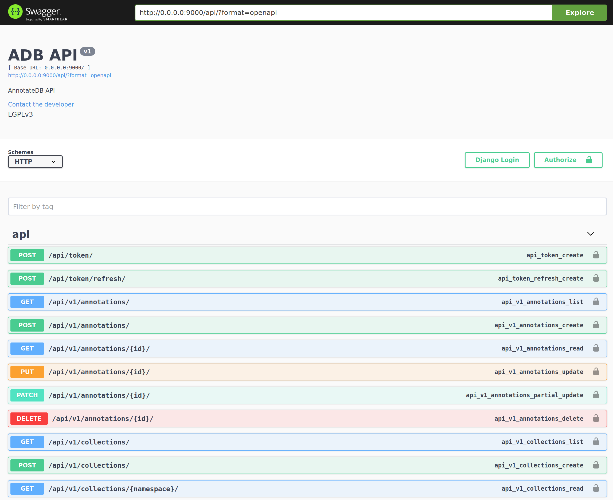

[](https://zenodo.org/badge/latestdoi/191741174)
[](http://opensource.org/licenses/LGPL-3.0)
[](https://badge.fury.io/gh/matthiaskoenig%2Fannotatedb)


<h1> AnnotateDB</h1>
<b><a href="https://orcid.org/0000-0003-1725-179X" title="https://orcid.org/0000-0003-1725-179X"></a> Matthias König</b>
and
<b><a href="https://orcid.org/0000-0002-4588-4925" title="0000-0002-4588-4925"></a> Jan Grzegorzewski</b>

`AnnotateDB` (pronounced `annotated bee`, https://annotatedb.com) is a database with web frontend for mapping of annotations found in computational models in biology.
**Our mission** is to provide mapped annotation resources which simplify annotation of computational models and mapping of entities in such models.
**Our vision** is to provide a single integrated knowledge resource which simplifies mapping between commonly occurring 
annotations in biological models and data.

`AnnotateDB` provides a high quality mapping of annotations on each other based on existing resources. 
Key features are
- annotation mappings from multiple sources
- support for custom annotation mappings
- support for `qualifiers`, i.e., more detailed relationships between annotations
- support for evidence of annotations, i.e., provenance about the source and method with which the
mapping was inferred
- direct access to the `postgres` database
- `docker` and `docker-compose` scripts for easy local setup and deployment
- `REST` based web interface
- `elastisearch` based indexing and search

The `elasticsearch` are still in development.

### REST webservice
`AnnotateDB` provides `REST` endpoints for querying the database at https://annotatedb.com/api/v1.

<a href="https://annotatedb.com/api/v1"></a>

With the introduction of the `elasticsearch` endpoints the REST base search will largely improve.
For now users should directly interact with the postgres database (see information below).

### License
* Source Code: [LGPLv3](http://opensource.org/licenses/LGPL-3.0)
* Documentation: [CC BY-SA 4.0](http://creativecommons.org/licenses/by-sa/4.0/)

## Data sources

### Collections
#### identifiers.org
Information on collections is based mainly on [identifiers.org](http://identifiers.org/collection).
Collections were parsed with [`sbmlutils`](https://github.com/matthiaskoenig/sbmlutils).

### Mappings
#### BiGG
A major source of annotation mappings is the [BiGG Database](http://bigg.ucsd.edu/)
with information used from the latest database release available from
https://github.com/SBRG/bigg_models_data/releases. `AnnotateDB` currently includes `BiGG-v1.5`.


## Installation (docker-compose)
AnnotateDB is distributed as `docker` containers. This requires a working `docker` and `docker-compose`
installation on your system. 

The local setup is as simple as 
```bash
# clone or pull the latest source code
git clone https://github.com/matthiaskoenig/annotatedb.git
cd annotatedb

# set environment variables
set -a && source .env.local 

# create/rebuild all docker containers
./docker-purge.sh

# restore database
./adb_restore.sh

# elasticsearch indexing
./elasticsearch.sh

```
The services are running on the following ports

```
# postgres database
http://localhost:5434/

# vue.js frontend
http://localhost:8090/

# django backend
http://localhost:9000/

# elasticsearch
http://localhost:9124/
```
As soon as a more stable state of `AnnotateDB` is reached the installation will be further simplified.

## Working with the postgres database
The postgres database is accessible via
```
HOST: localhost
PORT: 5434
DB: adb
USER: adb
PASSWORD: adb
```
The database contains the following main tables:
- `adb_collection`: A data source or miriam collection for annotation or xref information
- `adb_annotation`: The combination of a term from a collection and the given collection
- `adb_mapping`: Mapping between annotations, from source annotation to target annotation. The kind of mapping is defined by the qualifier. E.g. the qualifier `BQM_IS` encodes that the source annotation `is` the target annotation.
- `adb_evidence`: Evidence for the given mapping between annotations.

In addition a materialized view for the mapping is provided which allows very easy filtering of 
mapped annotations: `mapping_view`. For most use cases the `mapping_view` is the table to work with.


### SQL queries
For instance query the `bigg.metabolite` for a given `chebi` identifier via
```sql
SELECT source_term FROM mapping_view 
    WHERE (target_term = 'CHEBI:698' AND
           target_namespace = 'chebi' AND 
           source_namespace = 'bigg.metabolite' AND
           qualifier = 'IS')
    ORDER BY target_namespace, target_term;
```
Which results in 
```
('10fthf',)
```
A more comprehensive list of SQL queries and use cases is provided [here](./docs/examples/python/example_postgres.py)
with output [here](./docs/examples/python/example_postgres.out).


## Release notes
### 0.1.1
* bug fixes admin interface 
* bug fixes frontend server
* enforcing uniqueness of mappings & removing duplicates
* materialized views
* detailed postgres examples 
* updated documentation

### 0.1.0
* vue frontend
* bigg mappings import
* database release files

### 0.0.1
* django development server
* first database schema
* docker-compose files for backend, database and elasticsearch


---
&copy; Matthias König and Jan Grzegorzewski